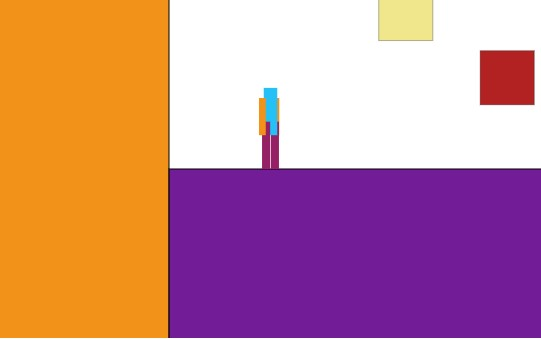
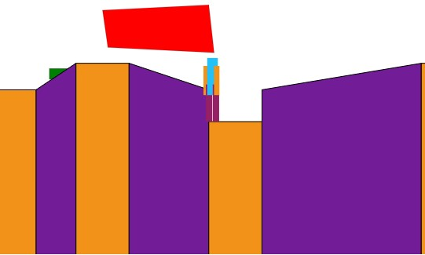
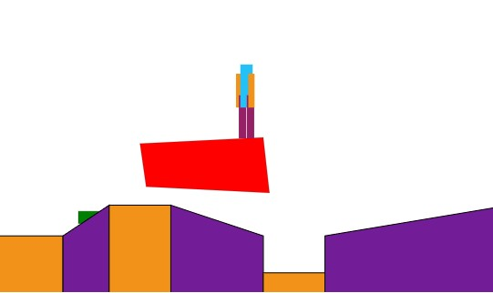

# Platform-Game-1

[Demo Video!](https://youtu.be/5cy3RYWRLlc)

I've always been curious to see whether I could create a platform game, and it is definitely questionable as to whether this qualifies.  It is, of course, a work in progress, but I'm adding this to GitHub now (May 18, 2022) because I finally figured out some of the basic aspects of getting a character to interact properly with the surroundings.  Physics is working properly - the player accelerates properly and stops when encountering physical objects.  (Of course, some physics properties are violated because of suspended blocks and double jumps, but these are by design.)

As of this posting, the only working routes are http://localhost:4000/test/ground1 and http://localhost:4000/test/ground2.  The ground1 route shows the character interacting with physical, impenetrable objects, and the ground2 route shows the character moving past background objects.  The port that I have set is 4000, of course.  The application is using Express and Handlebars to handle the controller and view portions of the MVC pattern, but thankfully the project doesn't really require any true models at this time.

If you wish to play around with this at this point for whatever reason, the left arrow key moves the character left, the right arrow key moves the party right, and the space bar makes the character jump.